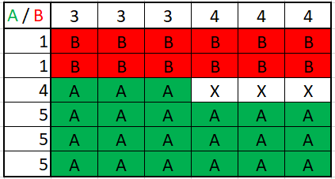
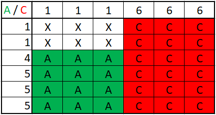
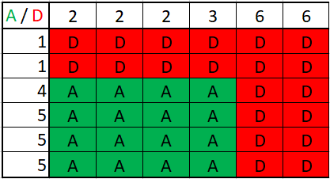
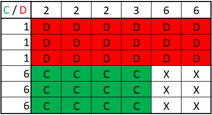
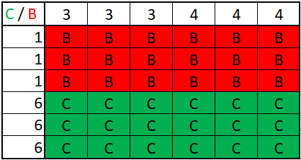
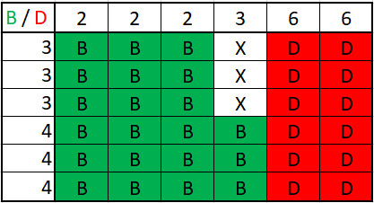
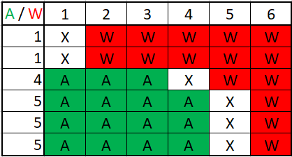
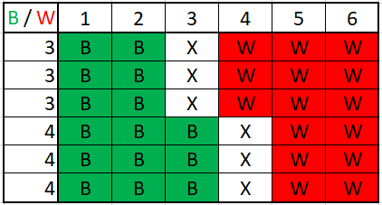
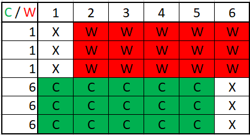
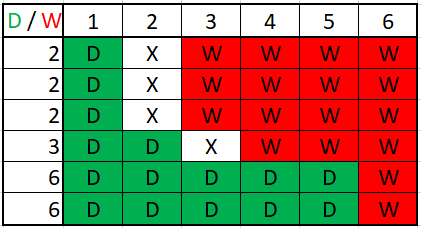

# Abgabe 1

## Authors
Sergej Bakanow, Denis Troccolo, Anselm Koch, Robin Schüle, Marvin Simon

## Aufgabe 1

### 1. 
Da jede Würfelseite die gleiche Chance hat oben zu landen und wir 6 Würfelseiten haben, 
hat jede Würfelseite eine Wahrscheinlichkeit von 1/6 (~16,66%) oben zu landen. Um die Stärke der Würfel zu bestimmen
lassen wir jeweils 2 Würfel gegeneinander antreten und bestimmen die Wahrscheinlichkeit des Sieges. Unentschieden werden
in der Wahrscheinlichkeitsberechnung nicht mit einbezogen, da bei einem Unentschieden einfach wieder neu gewürfelt wird.

### Vergleich Würfel A und Würfel B


Wie im Bild zu sehen hat Würfel A eine Wahrscheinlichkeit von 7/11 = ~63,63% und Würfel B eine Wahrscheinlichkeit von
4/11 = ~36,36% zu gewinnen.

**Ergebnis: A > B**

### Vergleich Würfel A und Würfel C


Wie im Bild zu sehen hat Würfel A eine Wahrscheinlichkeit von 4/10 = 40% und Würfel C eine Wahrscheinlichkeit von
3/5 = 60% zu gewinnnen. 

**Ergebnis: C > A**

### Vergleich Würfel A und Würfel D


Wie im Bild zu sehen hat Würfel A eine Wahrscheinlichkeit von 4/9 = ~44,44% und Würfel D eine Wahrscheinlichkeit von
5/9 = ~55,55% zu gewinnen.

**Ergebnis: D > A**

### Vergleich Würfel C und Würfel D


Wie im Bild zu sehen hat Würfel C eine Wahrscheinlichkeit von 4/10 = 40% und Würfel D eine Wahrscheinlichkeit von
3/5 = 60% zu gewinnen. 

**Ergebnis: D > C**

### Vergleich Würfel C und Würfel B


Wie im Bild zu sehen haben Würfel C und Würfel B beide eine Wahrscheinlichkeit von 1/2 = 50% zu gewinnen.

**Ergebnis: C = B**

### Vergleich Würfel B und Würfel D


Wie im Bild zu sehen hat Würfel B eine Wahrscheinlichkeit von 7/11 = ~ 63,63% und Würfel D eine Wahrscheinlichkeit von
4/11 = ~36,36% zu gewinnen.

**Ergebnis: B > D**

Wenn wir uns jetzt die Häufigkeiten der Siege eines Würfels gegen alle anderen Würfel anschauen ergibt sich, dass
Würfel D gegen 2 Würfel gewinnt (A und C) und 1 mal verliert (B)
Würfel B gewinnt gegen 1 Würfel (D), verliert gegen 1 Würfel (A) und trennt sich 1 mal unentschieden (C)
Würfel C gewinnt gegen 1 Würfel (A), verliert gegen 1 Würfel (D) und trennt sich 1 mal unentschieden (B)
Würfel A gewinnt gegen 1 Würfel (B) und verliert gegen 2 Würfel (C und D)

**Daraus ergibt sich die Reihenfolge (von schwach zu stark): A -> B = C -> D**


### 2. Vergleich Würfel A und normaler Würfel
    


### Vergleich Würfel B und normaler Würfel


### Vergleich Würfel C und normaler Würfel


### Vergleich Würfel D und normaler Würfel



   

## Aufgabe 2

1. Step 0: 1
Step 1: 1
Step 2: 1
Step 3: 2
Step 4: 5
Step 5: 12
Step 6: 30
Step 7: 78
Step 8: 205
Step 9: 547
Step 10: 1488
Step 11: 4104
Step 12: 11430
Step 13: 32111
Step 14: 90910
Step 15: 259087
Step 16: 742701
Step 17: 2140165
Step 18: 6195787
Step 19: 18011450
Step 20: 52556756
Step 21: 153881305
Step 22: 451948784
Step 23: 1331141032
Step 24: 3930882046
Step 25: 11635856286
Step 26: 34519968211
Step 27: 102620956036
Step 28: 305655819202
Step 29: 912019030930
Step 30: 2725831256483
Step 31: 8159657288069
Step 32: 24461385127725
Step 33: 73432509958669
Step 34: 220728914531525
Step 35: 664296349489186
Step 36: 2001553267953391
Step 37: 6037376821807766
Step 38: 18229742789073518
Step 39: 55098666357557710
Step 40: 166689703178220044
Step 41: 504735649912109426
Step 42: 1529637330718265973
Step 43: 4639436948397129770
Step 44: 14082460973189742652
Step 45: 42777315167918533446
Step 46: 130033826701010850056
Step 47: 395543320353306199451
Step 48: 1203966764544170063758
Step 49: 3666960664772638665846
Step 50: 11175284019467260920046
Step 51: 34076998460002462477556
Step 52: 103969272833242132724291
Step 53: 317380748380984889085147
Step 54: 969347612878126554097240
Step 55: 2962060008665104173649804
Step 56: 9055571839164961403284258
Step 57: 27697361744871204179971172
Step 58: 84752900002826381964805658
Step 59: 259452502764369494585450358
Step 60: 794588194351734520714782419
Step 61: 2434453114146430514382503803
Step 62: 7461569393773667859828305917
Step 63: 22878264356162983162139998618
Step 64: 70173800946780563052422752621
Step 65: 215318381507489179940273529949
Step 66: 660901527079753839392710747469
Step 67: 2029259164431428911854674961914
Step 68: 6232742028415134504442267864505
Step 69: 19149507520127675275634277666388
Step 70: 58853054412787565656492713208654
Step 71: 180929601569690846338933939296646
Step 72: 556385628651474427910435739163063
Step 73: 1711450800121248051980201709587293
Step 74: 5265891307273540374885130867210138
Step 75: 16206721464735816388067916109124804
Step 76: 49892035660888131529731039833880254
Step 77: 153630395274527188532683943275530829
Step 78: 473184097564864527487805706134733758
Step 79: 1457764966887043214445350001539410115
Step 80: 4492071494215940212621008295264863916
Step 81: 13845386864870716188477571092750134092
Step 82: 42683537820840723199263838888689062458
Step 83: 131616482470152053303914072542115886632
Step 84: 405931235570683638820677797006111112917
Step 85: 1252232069308590805839559811926168077971
Step 86: 3863716464070396893539237637598206675582
Step 87: 11923719144399075625240735839432570258138
Step 88: 36804620597847174506119313118115165476684
Step 89: 113625338613048851577285413612771499700378
Step 90: 350855635446959532853747290854519904683158
Step 91: 1083578515845743954330425548309277668857058
Step 92: 3347104541233613412893300124983775763249488
Step 93: 10340784425002959855150720551207503532908644
Step 94: 31952983416565716247409539664162914966882199
Step 95: 98751004463222461371607239891643934453567212
Step 96: 305240609470658118249431532072158698655059246
Step 97: 943653021450927559571739013693588543025165310
Step 98: 2917764153540230902497393350238662852003226070
Step 99: 9023073552950601695819250958215557785144367188

2. ```
    function calculatePaths(numberOfSteps, currentValue, resultSave): numberOfPaths {
        if numberOfSteps == 0
            return currentYValue == 0 ? 1 : 0
        
        for(every possible ySteps) {
            nextValue = currentYValue + yStep;
            if(nextValue >= 0) {
                search resultSave for entry
                if(resultSave no entry) {
                    call calculatePaths with (steps - 1, nextValue, resultSave)
                    save the return value in resultSave
                }
            }
            add result in a local variable
        }
        return the local variable which are the possible paths
    }


    main {
        input steps and call the calulatePaths function with an empty map and currentValue 0
        print return value
    }
    ```
3. ```
    function drawPaths(numberOfSteps, currentValue, resultSave): numberOfPaths {
        if numberOfSteps == 0
            return currentYValue == 0 ? 1 : 0
        
        for(every possible ySteps) {
            nextValue = currentYValue + yStep;
            if(nextValue >= 0) {
                search resultSave for entry
                if(resultSave no entry) {
                    call calculatePaths with (steps - 1, nextValue, resultSave)
                    save the return value in resultSave
                }
                if(resultSave entry) {
                    drawLine from currentvalue to nextValue;
                }
            }
            add result in a local variable
        }
        return the local variable which are the possible paths
    }


    main {
        input steps and call the drawPaths function with an empty map and currentValue 0
    }
    ```
4. n^2
5. Jedes result wird gespeichert in einer map, 
6. PathAnzahl * Steps + 1?